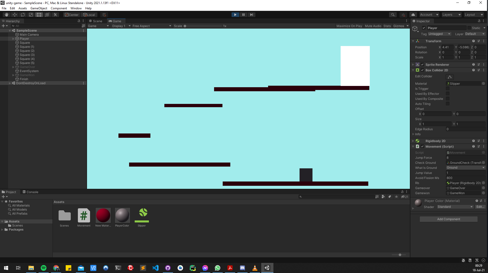

# mooc-game
This is a simple 2D jumping game, developed with 2 modalities in mind, haptic (keyboard) and visuals (microphone). 

## Open the game:
Just open Unity-Hub, click *Add* to add the project folder, and select the folder *unity-game*.  
This should automatically afterwards open the project (move the folder to a location where the suitable read/write rights are given).  
**Important:** In order to use the Microphone, you will have to go to *build settings -> player settings -> select your platform -> enable microphone*.
When the game is loaded, click the *Play* symbol on the top of Unity, and the game should start.  

## Gameplay:
The gameplay is pretty simple:  
- Keyboard: *a* for left, *d* for right and *w* for jump  
- Voice Commands: *left* for left, *right* for right and *up* for jump

## A Look on the Game:
Here is an image to demonstrate the simplicity of the game. Everything is packed in only 1 script.

## About:
This game is a project that has been assigned for the module *Multimodal Interaction*. The main idea is to develop a game, which is using two different modalities to control the game (in our case keyboard and microphone). 

